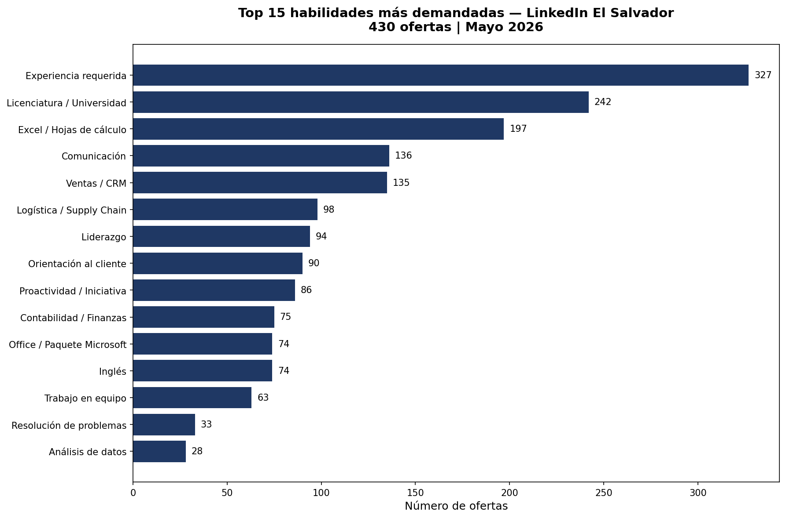
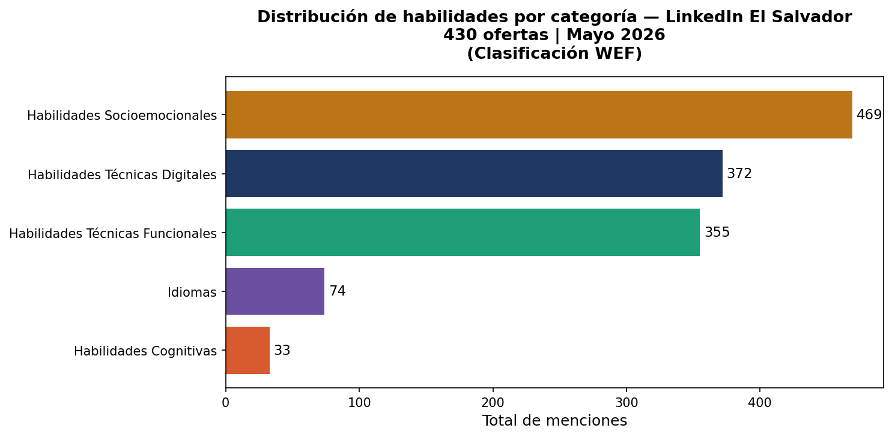

# Análisis de Habilidades del Mercado Laboral — El Salvador 2026

¿Qué habilidades está pidiendo realmente el mercado laboral en El Salvador?

Este proyecto responde esa pregunta con datos reales extraídos de LinkedIn Jobs El Salvador en mayo de 2026.

---

## Contexto y motivación

Todo comenzó en una conferencia: "Diseñando Credenciales Alternativas de Alto Impacto", impartida por el Dr. Limón del Tecnológico de Monterrey, organizada por INCAF.

La premisa era clara: para que una credencial alternativa sea relevante, tiene que serlo tanto para el profesional como para quien lo va a emplear. Pero eso plantea una pregunta más difícil: ¿qué está buscando realmente el mercado?

Decidí no suponerlo. Analicé 430 ofertas de empleo publicadas en LinkedIn El Salvador y busqué patrones en lo que las empresas realmente piden.

---

## Contenido del repositorio

| Archivo | Descripción |
|---|---|
| README.md | Este documento |
| dataset_linkedin_elsalvador_mayo2026.json | Dataset original extraído de LinkedIn (430 ofertas) |
| analisis_habilidades.ipynb | Notebook con el código completo y los hallazgos documentados |
| analisis_habilidades.pbix | Dashboard interactivo en Power BI (requiere Power BI Desktop para abrir) |
| top15_habilidades.png | Gráfico: Top 15 habilidades más demandadas |
| categorias_wef.png | Gráfico: Distribución por categoría (marco WEF) |

---

## Dashboard interactivo

El archivo `analisis_habilidades.pbix` contiene un dashboard de 4 páginas:

- **Visión general** — métricas clave, Top 15 habilidades y distribución por categoría
- **Habilidades por categoría** — exploración interactiva usando la clasificación del WEF
- **Habilidades por industria** — qué pide cada sector del mercado
- **Habilidades por zona** — distribución geográfica por departamento

Para visualizarlo, descarga el archivo y ábrelo con Power BI Desktop (gratuito en microsoft.com/power-bi).

---

## Metodología

### Fuente de datos
- Plataforma: LinkedIn Jobs El Salvador (sv.linkedin.com/jobs)
- Herramienta de extracción: Apify — LinkedIn Jobs Scraper
- Fecha de extracción: 12 de mayo de 2026
- Total de ofertas: 430 publicaciones activas

### Proceso de análisis
1. Extracción: Web scraping de ofertas activas en LinkedIn El Salvador vía Apify
2. Limpieza: Normalización de texto (minúsculas, eliminación de valores vacíos, combinación de título y descripción)
3. Detección de habilidades: Búsqueda de palabras clave en español e inglés usando un diccionario de 23 competencias
4. Cuantificación: Conteo de frecuencia absoluta y relativa por habilidad
5. Categorización: Clasificación usando el marco del Foro Económico Mundial (WEF)
6. Visualización: Gráficos en Python (matplotlib) y dashboard interactivo en Power BI

### Herramientas
- Python 3 — pandas, collections, matplotlib
- Apify — extracción de datos
- Jupyter Notebook — desarrollo y documentación del análisis
- Power BI Desktop — dashboard interactivo

### Clasificación WEF aplicada

| Categoría | Habilidades incluidas |
|---|---|
| Habilidades Técnicas Digitales | Excel, SQL, Power BI, Python, Análisis de datos, IA, SAP, Office |
| Habilidades Técnicas Funcionales | Contabilidad, Ventas, Logística, Marketing Digital, Gestión de proyectos |
| Habilidades Socioemocionales | Liderazgo, Trabajo en equipo, Comunicación, Orientación al cliente, Proactividad |
| Habilidades Cognitivas | Resolución de problemas |
| Idiomas | Inglés |

---

## Hallazgos principales

La categoría con mayor demanda no fue tecnología, ni finanzas, ni logística.

**Fueron las habilidades socioemocionales.**

Comunicación, liderazgo, orientación al cliente y proactividad aparecen en casi toda oferta, sin importar el sector o el nivel del puesto.

### Top 5 habilidades más demandadas

| # | Habilidad | Frecuencia | % de ofertas |
|---|---|---|---|
| 1 | Experiencia requerida | 327 | 76.0% |
| 2 | Licenciatura / Universidad | 242 | 56.3% |
| 3 | Excel / Hojas de cálculo | 197 | 45.8% |
| 4 | Comunicación | 136 | 31.6% |
| 5 | Ventas / CRM | 137 | 31.9% |

### Visualizaciones

---

## Limitaciones

- Los datos provienen de una sola fuente (LinkedIn), que tiende a sobrerrepresentar sectores formales y empresas medianas y grandes
- La detección de habilidades se basa en palabras clave predefinidas; habilidades descritas con terminología no convencional pueden no haberse capturado
- La muestra corresponde a un momento específico (mayo 2026) y puede no reflejar variaciones estacionales
- No se incluyeron bolsas de empleo locales como Tecoloco o Computrabajo, que capturan un segmento diferente del mercado
- El 51% de las ofertas se concentran en San Salvador, lo que refleja la centralización del mercado laboral formal en El Salvador

---

## Autora

Jakelin Rivera
Analista de datos | MBA — INCAE Business School
El Salvador

---

## Licencia

Este proyecto es de uso libre para fines educativos y de investigación. Si usas estos datos o metodología, por favor cita la fuente.
